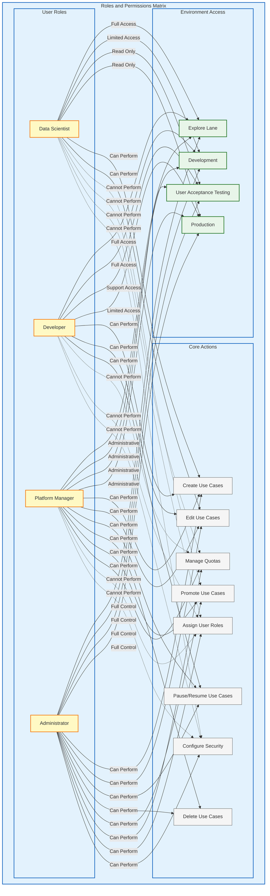
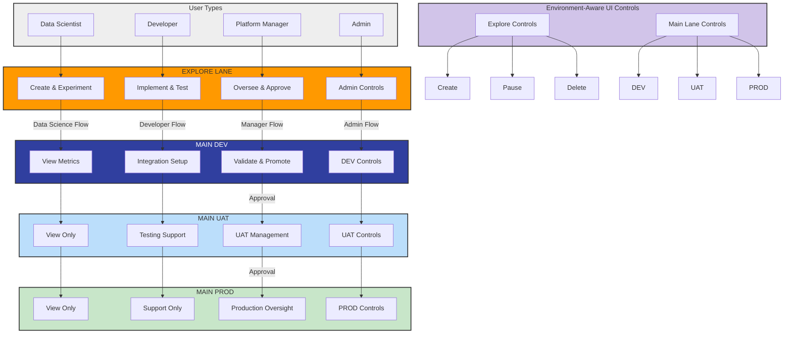
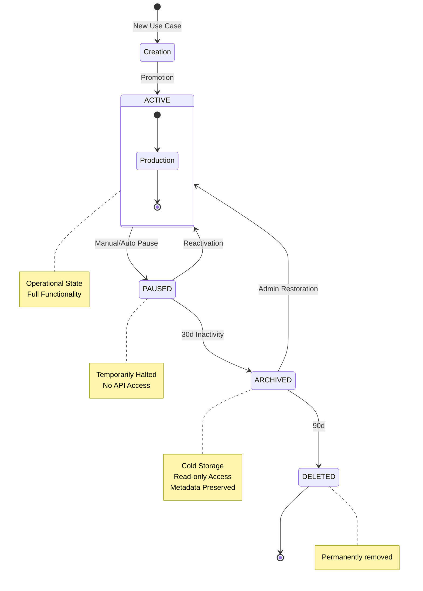
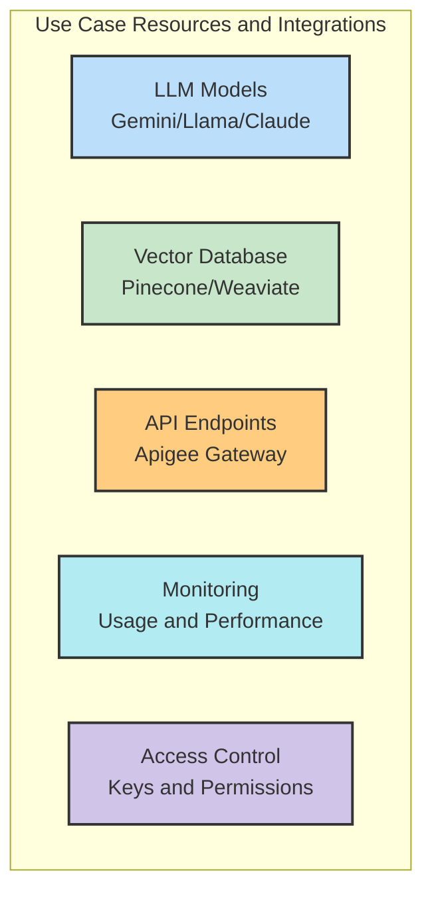
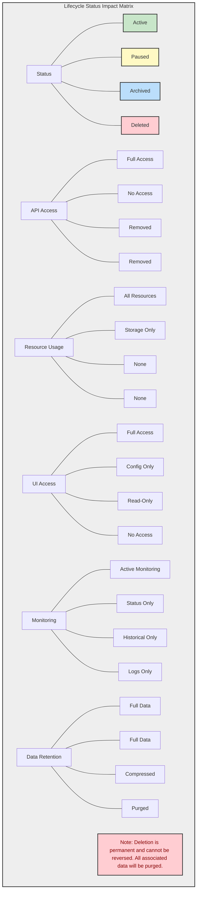
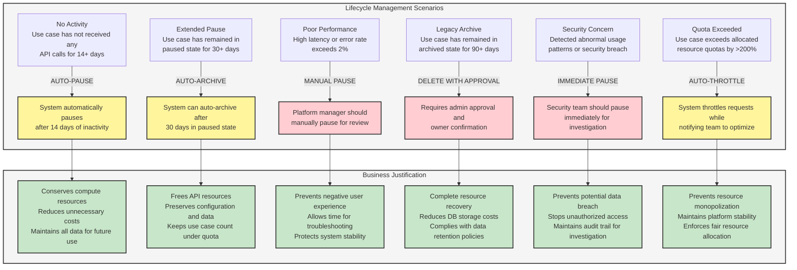
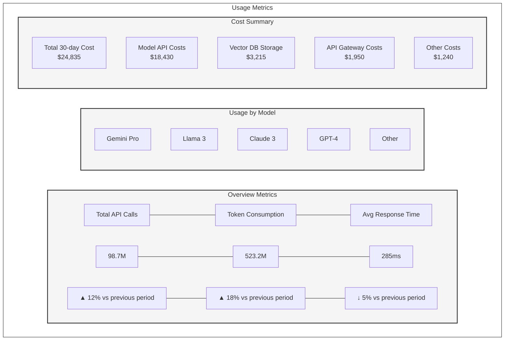
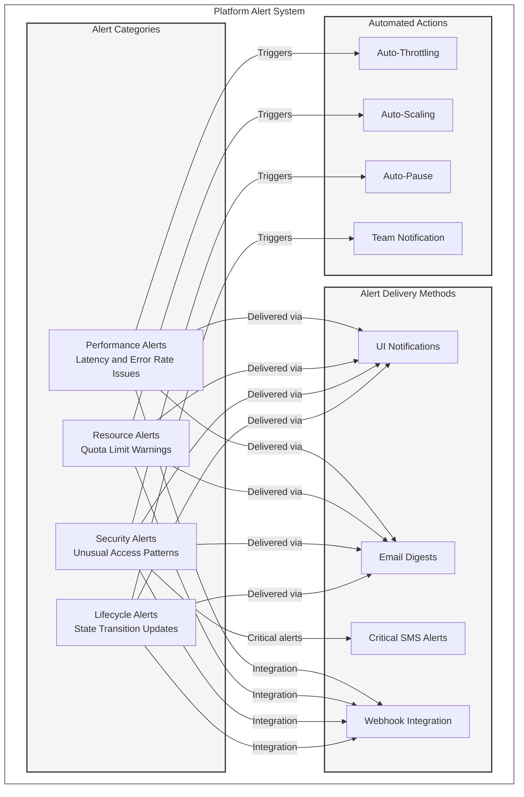

# GenAI Platform Implementation Plan: Use Case & API Lifecycle Management

## Executive Summary

This document outlines the comprehensive implementation plan for our GenAI platform's lifecycle management capabilities. The platform will enable the creation, management, and monitoring of AI use cases and APIs across different environments (development, testing, and production) for various user personas including data scientists, developers, platform managers, and administrators.

The solution architecture follows a "single codebase with environment context" approach, allowing seamless promotion of use cases from exploration to production while maintaining appropriate governance, resource management, and access controls. The implementation will support both RAG-based applications and model API endpoints, with comprehensive lifecycle management from creation to retirement.

## Business Goals & Success Metrics

Primary Business Goals

1. **Streamline AI Use Case Development**: Reduce time from ideation to production deployment by 70%
2. **Optimize Resource Utilization**: Improve cost efficiency by 40% through quota management and automatic resource cleanup
3. **Ensure Production Reliability**: Maintain 99.9% uptime for production use cases with comprehensive monitoring
4. **Support Self-Service Model**: Enable data scientists and developers to create and test use cases with minimal IT support
5. **Enforce Appropriate Governance**: Maintain control over production environments while enabling innovation

### Success Metrics

| Metric | Current | Target | Timeline |
|--------|---------|--------|----------|
| Average time to production | 6 weeks | 2 weeks | Q3 2025 |
| Resource utilization | 45% | 75% | Q4 2025 |
| Production use case uptime | 99.5% | 99.9% | Q3 2025 |
| Monthly active users | 130 | 300 | Q4 2025 |
| Number of production use cases | 45 | 120 | Q1 2026 |
| Automated governance compliance | 60% | 95% | Q3 2025 |

## Platform Architecture Overview

The GenAI platform is built on a "single codebase with environment context" architecture that provides a unified interface for managing use cases across different environments while enforcing appropriate controls based on the environment context.

### Core Architecture Components

```mermaid
flowchart TD
    subgraph SystemArchitecture[Complete GenAI Platform System Architecture]
        subgraph FrontendLayer[Frontend Layer]
            WebUI[Web User Interface]
            MobileUI[Mobile Interface]
            CLITool[Command Line Tools]
        end
        
        subgraph ApplicationLayer[Application Layer]
            AuthService[Authentication & Authorization Service]
            ECProvider[Environment Context Provider]
            UCManager[Use Case Management Service]
            APIManager[API Management Service]
            QuotaService[Quota Management Service]
            MonitorService[Monitoring & Analytics Service]
        end
        
        subgraph IntegrationLayer[Integration Layer]
            ApigeeGateway[Apigee API Gateway]
            IdentityConnector[Identity Provider Connector]
            MonitoringConnector[Monitoring System Connector]
            AlertingConnector[Alerting System Connector]
        end
        
        subgraph DataLayer[Data Layer]
            ConfigDB[Configuration Database]
            MetricsDB[Metrics & Analytics Database]
            AuditDB[Audit & Logging Database]
            VectorDBs[Vector Databases]
        end
        
        subgraph AILayer[AI Service Layer]
            ModelServices[LLM Model Services]
            EmbeddingServices[Embedding Services]
            RAGServices[RAG Pipeline Services]
        end
        
        subgraph InfrastructureLayer[Infrastructure Layer]
            GCPServices[Google Cloud Services]
            AzureServices[Azure Services]
            K8sCluster[Kubernetes Clusters]
            MonitoringInfra[Monitoring Infrastructure]
        end
        
        FrontendLayer -->|User Requests| ApplicationLayer
        ApplicationLayer -->|API Management| IntegrationLayer
        IntegrationLayer -->|Data Storage| DataLayer
        IntegrationLayer -->|AI Processing| AILayer
        DataLayer -.->|Configuration| AILayer
        AILayer -->|Runs On| InfrastructureLayer
        DataLayer -->|Hosted On| InfrastructureLayer
        ApplicationLayer -.->|Metrics| DataLayer
    end
    
    classDef layer fill:#E3F2FD,stroke:#1565C0,stroke-width:2px
    classDef component fill:#F5F5F5,stroke:#616161,stroke-width:1px
    
    class SystemArchitecture,FrontendLayer,ApplicationLayer,IntegrationLayer,DataLayer,AILayer,InfrastructureLayer layer
    class WebUI,MobileUI,CLITool,AuthService,ECProvider,UCManager,APIManager,QuotaService,MonitorService,ApigeeGateway,IdentityConnector,MonitoringConnector,AlertingConnector,ConfigDB,MetricsDB,AuditDB,VectorDBs,ModelServices,EmbeddingServices,RAGServices,GCPServices,AzureServices,K8sCluster,MonitoringInfra component
```



### User Persona Roles and Permissions Matrix



### Reference Documentation

Below is a list of key reference documentation that will be useful during the implementation:

1. **API Management**
   - [Apigee API Management Documentation](https://cloud.google.com/apigee/docs)
   - [Apigee API Gateway Best Practices](https://cloud.google.com/apigee/docs/api-platform/fundamentals/best-practices-api-design)
   - [OpenAPI Specification](https://swagger.io/specification/)

2. **Vector Database Integration**
   - [Pinecone API Reference](https://docs.pinecone.io/reference)
   - [Weaviate Integration Guide](https://weaviate.io/developers/weaviate)
   - [ChromaDB Documentation](https://docs.trychroma.com/)

3. **LLM Provider Documentation**
   - [Google Gemini API Documentation](https://ai.google.dev/docs)
   - [Anthropic Claude API Reference](https://docs.anthropic.com/en/docs/)
   - [Meta Llama Documentation](https://llama.meta.com/docs/)

4. **Security & Authorization**
   - [OAuth 2.0 Framework](https://oauth.net/2/)
   - [OpenID Connect](https://openid.net/connect/)
   - [Role-Based Access Control Implementation Guide](https://csrc.nist.gov/CSRC/media/Publications/conference-paper/1992/10/13/proceedings-15th-national-computer-security-conference-1992/documents/1992-15th-NCSC-proceedings-vol-2.pdf)

5. **Cloud Infrastructure**
   - [Google Cloud Platform Documentation](https://cloud.google.com/docs)
   - [Microsoft Azure Documentation](https://learn.microsoft.com/en-us/azure/)
   - [Kubernetes Documentation](https://kubernetes.io/docs/home/)

6. **Monitoring & Analytics**
   - [Prometheus Documentation](https://prometheus.io/docs/introduction/overview/)
   - [Grafana Documentation](https://grafana.com/docs/)
   - [OpenTelemetry Framework](https://opentelemetry.io/docs/)
d
flowchart TD
    User([Users & Roles]) --> Auth[Authentication & Role-Based Access Control]
    Auth --> ECP[Environment Context Provider]
    
    ECP -->|Explore Context Flow| EAUI1[Environment-Aware UI Components]
    ECP -->|Main Context Flow| EAUI2[Environment-Aware UI Components]
    
    subgraph UIComponents[Environment-Aware UI Components]
        ELANE[EXPLORE LANE CONTEXT]
        MLANE[MAIN LANE CONTEXT]
        SHARED[Shared Core Components\nAdapt behavior based on context]
        
        ELANE --- SHARED --- MLANE
        
        ELANE --> EC[Explore Components]
        ELANE --> SCA[Shared Actions]
        MLANE --> MC[Main Components]
        MLANE --> AA[Available Actions]
        
        subgraph EnvSwitch[Environment Switch]
        end
        
        SHARED --- EnvSwitch
    end
    
    UIComponents -->|API Calls| ESAPI[Environment-Specific API Services]
    
    ESAPI -->|Dev| EAPI[Explore API Service]
    ESAPI -->|Dev| DAPI[Main DEV API Service]
    ESAPI -->|Prod| PAPI[Main PROD API Service]
    
    EAPI --> EMongo[Explore MongoDB]
    DAPI --> MMongo[Main MongoDB Instances]
    PAPI --> MMongo
    
    classDef orange fill:#FF9900,stroke:#333,stroke-width:2px
    classDef blue fill:#BBDEFB,stroke:#333,stroke-width:2px
    classDef green fill:#C8E6C9,stroke:#333,stroke-width:2px
    classDef gray fill:#EEEEEE,stroke:#333,stroke-width:2px
    classDef pink fill:#FCE4EC,stroke:#333,stroke-width:2px
    classDef yellow fill:#FFF9C4,stroke:#333,stroke-width:2px
    
    class User gray
    class Auth pink
    class ECP blue
    class UIComponents green
    class ELANE orange
    class MLANE darkblue
    class ESAPI yellow
    class EnvSwitch gray
```

1. **Environment Context Provider**: Central component that maintains awareness of the current environment and adjusts the UI, permissions, and available actions accordingly
2. **Authentication & Role-Based Access Control**: Manages user identity and permissions based on roles and environment context
3. **Environment-Aware UI Components**: Adapts UI elements based on environment context and user role
4. **Shared Core Components**: Common UI elements and functionality that work across environments
5. **Environment-Specific API Services**: Dedicated API endpoints for each environment (Explore, Dev, UAT, Prod)
6. **Infrastructure Integration**: Connections to underlying services including vector databases, LLM services, and monitoring systems

### Environment Separation

The platform supports four primary environments:

1. **Explore Lane**: Experimentation environment for data scientists and developers with minimal restrictions
2. **Main Dev**: Development environment with basic governance and more structured resources
3. **Main UAT**: Testing environment that mirrors production with read-only access for most users
4. **Main Prod**: Production environment with strict governance and access controls

## User Personas & Journey Mapping

We've identified four core user personas that will interact with the platform:

### Data Scientist
**Primary Goals**: Experiment with models, create prototypes, analyze performance
**Key Capabilities**: Create use cases, test models, analyze performance metrics
**Environment Access**: Full access to Explore, limited access to Dev, read-only for UAT/Prod

### Developer
**Primary Goals**: Implement and integrate AI services, optimize performance
**Key Capabilities**: Configure APIs, implement integration code, test systems
**Environment Access**: Full access to Explore/Dev, support access to UAT, limited access to Prod

### Platform Manager
**Primary Goals**: Oversee platform usage, approve promotions, manage resources
**Key Capabilities**: Monitor usage, approve environment transitions, manage quotas
**Environment Access**: Administrative access to all environments

### Super Admin
**Primary Goals**: Manage platform configuration, users, and security
**Key Capabilities**: Configure environments, manage users/teams, set global policies
**Environment Access**: Full administrative access to all environments and settings

### User Journey Map



The journey map illustrates how each persona interacts with the platform across different environments, showing the progression of use cases from creation to production with animated flow lines indicating directional movement.

## Use Case Lifecycle Management

### Lifecycle States

Use cases in the platform follow a defined lifecycle with the following states:



1. **Creation**: Initial development and configuration phase
2. **Active**: Fully operational state in a specific environment
3. **Paused**: Temporarily suspended state (no API access but configuration preserved)
4. **Archived**: Cold storage state with read-only access and minimal resource usage
5. **Deleted**: Permanently removed state (data purged according to retention policies)

### Use Case Resources and Integrations



### Lifecycle Status Impact Matrix



### Lifecycle Transition Rules

The platform will implement automated rules to govern state transitions:



### Environment Promotion Workflow

Use cases follow a structured promotion path across environments:

1. **Explore → Dev**: Initial promotion requiring basic validation
2. **Dev → UAT**: Promotion requiring thorough testing and approval
3. **UAT → Prod**: Final promotion requiring business approval and compliance validation

Each promotion includes configuration freezing, resource allocation validation, and appropriate approvals based on policy.

## Resource & Quota Management

### Platform-wide Quota Management

```mermaid
flowchart TB
    subgraph PlatformQuotas[Platform Quotas]
        direction TB
        PDQ[Total Daily API Calls<br>5.2M / 10M] 
        PTU[Total Token Usage<br>182M / 500M]
        PVDB[Vector DB Storage<br>1.8TB / 5TB]
        PAU[Active Use Cases<br>128 / 200]
    end
    
    subgraph QuotaConfig[Platform Quota Configuration]
        Resource[Resource]
        CL[Current Limit]
        AL[Adjust Limit]
        AT[Alert Threshold]
        
        Resource1[LLM API Calls (Daily)] --- CL1[10,000,000] --- AL1[10,000,000] --- AT1[80%]
        Resource2[Token Usage (Monthly)] --- CL2[500,000,000] --- AL2[500,000,000] --- AT2[75%]
        Resource3[Vector DB Storage] --- CL3[5 TB] --- AL3[5 TB] --- AT3[90%]
        Resource4[Max Active Use Cases] --- CL4[200] --- AL4[200] --- AT4[85%]
        
        Warning[⚠️ Exceeding these limits will trigger alerts. Auto-scaling is enabled for all resources except max use cases.]
    end
    
    classDef blue fill:#E3F2FD,stroke:#333,stroke-width:2px
    classDef gray fill:#F5F5F5,stroke:#333,stroke-width:2px
    classDef warning fill:#FFF3E0,stroke:#FF9800,stroke-width:2px,color:#E65100
    
    class PlatformQuotas,QuotaConfig blue
    class Resource,CL,AL,AT gray
    class Warning warning
```

### Team Quota Management

```mermaid
flowchart TB
    subgraph TeamUsage[Data Science Team Resource Usage]
        DataScienceInfo[Team has 28 members, 12 active use cases in production]
        direction LR
        TAPI[API Calls: 1.2M / 2M]
        TTokens[Tokens: 42M / 100M]
        TStorage[Storage: 620GB / 1TB]
        TUC[Use Cases: 12 / 25]
    end
    
    subgraph TeamQuota[Team Quota Configuration]
        TResource[Resource]
        TPL[Platform Limit]
        TTA[Team Allocation]
        TAA[Adjust Allocation]
        TAlert[Alert]
        
        TResource1[API Calls (Daily)] --- TPL1[10,000,000] --- TTA1[2,000,000 (20%)] --- TAA1[2,000,000] --- TAlert1[80%]
        TResource2[Token Usage (Monthly)] --- TPL2[500,000,000] --- TTA2[100,000,000 (20%)] --- TAA2[100,000,000] --- TAlert2[75%]
        TResource3[Vector DB Storage] --- TPL3[5 TB] --- TTA3[1 TB (20%)] --- TAA3[1 TB] --- TAlert3[90%]
        TResource4[Max Active Use Cases] --- TPL4[200] --- TTA4[25 (12.5%)] --- TAA4[25] --- TAlert4[85%]
        
        TempWarning[ℹ️ Temporary quota increase requests require Platform Manager approval. Bursting available for 72 hours.]
    end
    
    classDef blue fill:#E3F2FD,stroke:#333,stroke-width:2px
    classDef gray fill:#F5F5F5,stroke:#333,stroke-width:2px
    classDef info fill:#E8F5E9,stroke:#4CAF50,stroke-width:2px,color:#1B5E20
    
    class TeamUsage,TeamQuota blue
    class TResource,TPL,TTA,TAA,TAlert gray
    class TempWarning info
```

The platform will implement multi-level quota management:

1. **Platform Quotas**: Global limits on total resource consumption
2. **Team Quotas**: Allocations for specific teams or departments
3. **Individual Quotas**: Limits for individual users
4. **Use Case Quotas**: Constraints on specific use case resource consumption

### Monitored Resources

The system will track and manage quotas for:

- LLM API Calls (daily/monthly)
- Token Usage (input/output)
- Vector Database Storage
- Vector Database Queries
- Maximum Active Use Cases

### Quota Enforcement Mechanisms

- **Alert Thresholds**: Configurable notifications when approaching limits
- **Hard Limits**: Enforced caps on resource consumption
- **Auto-scaling**: Optional dynamic resource adjustment for certain resources
- **Burst Capacity**: Temporary quota increases with appropriate approvals

## API Management Integration

### API Gateway Integration

```mermaid
flowchart TD
    subgraph APIManagement[API Management]
        subgraph Endpoints[API Endpoints]
            direction LR
            Endpoint[API Endpoint] --- Model[Model] --- Version[Version] --- Status[Status] --- Traffic[Traffic] --- Actions[Actions]
            Endpoint1[/api/v1/completion] --- Model1[Gemini Pro] --- Version1[1.2.0] --- Status1[ACTIVE] --- Traffic1[1.2M/day] --- Actions1[Manage]
            Endpoint2[/api/v1/embedding] --- Model2[Llama 3] --- Version2[1.0.1] --- Status2[ACTIVE] --- Traffic2[885K/day] --- Actions2[Manage]
            Endpoint3[/api/v2/chat] --- Model3[Claude 3] --- Version3[2.0.0] --- Status3[ACTIVE] --- Traffic3[620K/day] --- Actions3[Manage]
            Endpoint4[/api/v1/summary] --- Model4[GPT-4] --- Version4[1.1.2] --- Status4[PAUSED] --- Traffic4[0/day] --- Actions4[Manage]
            Endpoint5[/api/v1/classify] --- Model5[Gemini Flash] --- Version5[0.9.5] --- Status5[DEV] --- Traffic5[125K/day] --- Actions5[Manage]
        end
        
        subgraph Metrics[API Metrics]
            direction LR
            TE[Total API Endpoints] --- DC[Daily API Calls] --- RT[Avg. Response Time]
            TE1[84] --- DC1[3.2M] --- RT1[245ms]
        end
    end
    
    classDef gray fill:#F5F5F5,stroke:#333,stroke-width:2px
    classDef white fill:white,stroke:#333,stroke-width:1px
    
    class APIManagement white
    class Endpoints,Metrics gray
    class Endpoint,Model,Version,Status,Traffic,Actions white
    class TE,DC,RT white
```

### API Keys Management

```mermaid
flowchart TD
    subgraph KeyManagement[API Keys Management]
        subgraph KeysMetrics[Keys Metrics]
            direction LR
            TAK[Total Active API Keys] --- KES[Keys Expiring Soon (30 days)]
            TAK1[142 across 28 teams] --- KES1[17]
        end
        
        subgraph KeysList[API Keys]
            direction LR
            KeyName[Key Name] --- Owner[Owner] --- Created[Created] --- Expires[Expires] --- Status[Status] --- Actions[Actions]
            Key1[marketing-campaign-q2] --- Owner1[Marketing Team] --- Created1[Feb 12, 2025] --- Expires1[May 12, 2025] --- Status1[ACTIVE] --- Actions1[Manage]
            Key2[customer-support-chat] --- Owner2[Support Team] --- Created2[Jan 05, 2025] --- Expires2[Apr 05, 2025] --- Status2[ACTIVE] --- Actions2[Manage]
            Key3[product-dev-prototype] --- Owner3[RnD Team] --- Created3[Mar 15, 2025] --- Expires3[Apr 15, 2025] --- Status3[ACTIVE] --- Actions3[Manage]
            Key4[sales-insights-dashboard] --- Owner4[Sales Team] --- Created4[Dec 10, 2024] --- Expires4[Mar 10, 2025] --- Status4[REVOKED] --- Actions4[Manage]
            Key5[hr-resume-analyzer] --- Owner5[HR Team] --- Created5[Feb 28, 2025] --- Expires5[May 28, 2025] --- Status5[ACTIVE] --- Actions5[Manage]
        end
    end
    
    classDef gray fill:#F5F5F5,stroke:#333,stroke-width:2px
    classDef white fill:white,stroke:#333,stroke-width:1px
    
    class KeyManagement white
    class KeysMetrics,KeysList gray
    class KeyName,Owner,Created,Expires,Status,Actions white
```

The platform will integrate with Apigee for API management, providing:

1. **API Endpoint Creation**: Automated endpoint generation for use cases
2. **API Security**: Authentication, authorization, and encryption
3. **Rate Limiting**: Traffic management and quota enforcement
4. **Analytics**: Usage tracking and performance monitoring
5. **Versioning**: API version management and backward compatibility support

### API Lifecycle States

APIs follow a parallel lifecycle to use cases:

- **Development**: Initial API configuration and testing
- **Active**: Fully operational API accepting requests
- **Deprecated**: Scheduled for retirement but still functional
- **Retired**: Completely decommissioned API

## Monitoring & Analytics

### Platform Overview Dashboard

```mermaid
flowchart TD
    subgraph Overview[Platform Overview Dashboard]
        subgraph Metrics[Key Metrics]
            direction LR
            TUC[Total Use Cases] --- AAPI[Active APIs] --- RU[Registered Users] --- TC[Total Cost (MTD)]
            TUC1[128] --- AAPI1[84] --- RU1[243] --- TC1[$24,835]
            TUCT[▲ 12% (30d)] --- AAPIT[▲ 8% (30d)] --- RUT[▲ 15% (30d)] --- TCT[▲ 23% (30d)]
        end
        
        subgraph Health[System Health]
            direction TB
            APIG[API Gateway: 100% Uptime]
            VDB[Vector DBs: 99.98% Uptime]
            LLMS[LLM Services: 99.9% Uptime]
            MS[Model Service: High Load]
        end
        
        subgraph Alerts[Recent Alerts]
            QE[Quota Exceeded - Customer Service<br>1 hour ago - API Call Limits]
            ASC[Auto-scaled - Vector DB Capacity<br>3 hours ago - Usage Threshold]
            HAL[High API Latency - Gemini Endpoint<br>5 hours ago - Performance]
        end
        
        subgraph Approvals[Pending Approvals]
            PD[Production Deployment: CSBB-FLM-028<br>Requested by: Data Science Team]
            NAK[New API Key: Marketing Department<br>Requested by: J. Peterson]
            RQI[Resource Quota Increase: RnD Team<br>Requested by: S. Chen]
        end
    end
    
    classDef white fill:white,stroke:#333,stroke-width:1px
    classDef gray fill:#F5F5F5,stroke:#333,stroke-width:2px
    classDef alert fill:#FFF3E0,stroke:#FF9800,stroke-width:2px
    
    class Overview white
    class Metrics,Health gray
    class Alerts alert
    class Approvals gray
```

### Usage Metrics Dashboard



### Use Case Detail & Actions View

```mermaid
flowchart TD
    subgraph UCDetail[Use Case Actions & Limits]
        subgraph UCInfo[Use Case Info]
            UCTitle[Use Case: PRT-CSBB-FLM-001 (Customer Sentiment Analysis)]
            UCMeta[Created by: Marketing Team | Last updated: March 2, 2025]
        end
        
        subgraph UCStatus[Current Status & Performance]
            direction LR
            APIToday[API Calls (Today)] --- Latency[Avg. Latency] --- ErrorRate[Error Rate] --- VDBRecords[Vector DB Records]
            APIToday1[3,572] --- Latency1[285ms] --- ErrorRate1[0.08%] --- VDBRecords1[15,723]
            APIPerf[▲ 12% vs avg] --- LatPerf[↓ 5% vs avg] --- ErrorPerf[↓ 15% vs avg] --- VDBPerf[▲ 32% vs avg]
        end
        
        subgraph UCActions[Use Case Actions]
            subgraph PauseAction[Pause Use Case]
                PauseDesc[Temporarily suspends API access and LLM calls.<br>Data and configuration will be preserved.]
                PauseNotify[☑ Notify stakeholders]
                PauseBtn[Pause Now]
            end
            
            subgraph DeleteAction[Delete Use Case]
                DeleteDesc[Permanently removes this use case and all associated data.<br>This action cannot be undone.]
                DeleteConfirm[☐ I understand the risk]
                DeleteInput[Type "DELETE" to confirm]
                DeleteBtn[Delete]
            end
        end
        
        subgraph LimitsConfig[Resource Limits Configuration]
            direction TB
            MaxAPILabel[Maximum API Calls (Daily)] --- MaxAPIValue[10,000 calls] --- MaxAPIBtn[Apply]
            MaxTokenLabel[Maximum Token Usage (Daily)] --- MaxTokenValue[500,000 tokens] --- MaxTokenBtn[Apply] 
            MaxVDBLabel[Maximum Vector DB Records] --- MaxVDBValue[25,000 records] --- MaxVDBBtn[Apply]
            AutoPauseLabel[Auto-Pause after Inactivity] --- AutoPauseValue[14 days] --- AutoPauseBtn[Apply All]
        end
    end
    
    classDef white fill:white,stroke:#333,stroke-width:1px
    classDef gray fill:#F5F5F5,stroke:#333,stroke-width:2px
    classDef warning fill:#FFEBEE,stroke:#F44336,stroke-width:2px
    classDef action fill:#FFF3E0,stroke:#FF9800,stroke-width:2px
    
    class UCDetail white
    class UCInfo,UCStatus gray
    class PauseAction action
    class DeleteAction warning
    class LimitsConfig gray
```

### Use Case Lifecycle Status Workflow

```mermaid
flowchart TD
    subgraph UCLM[Use Case Lifecycle Management]
        subgraph StatusFlow[Use Case Status Workflow]
            StatusDesc[This diagram shows the lifecycle states of use cases and transition conditions.]
            
            subgraph States[Status States]
                ACTIVE[ACTIVE<br>Full operational state] -->|Manual pause<br>or 14d inactivity| PAUSED[PAUSED<br>No API/LLM calls]
                PAUSED -->|Reactivation| ACTIVE
                PAUSED -->|30d in paused state| ARCHIVED[ARCHIVED<br>Read-only access]
                ARCHIVED -->|Restoration| ACTIVE
                ARCHIVED -->|90d in archived state| DELETED[DELETED<br>Permanently removed]
                
                DEV[DEV<br>Development phase] -->|Promotion| ACTIVE
                ACTIVE -.->|Manual promotion| DEV
            end
            
            subgraph Guidelines[Status Management Guidelines]
                ActiveGuidelines[ACTIVE Status<br>• Use cases are fully operational and accessible<br>• Resources allocated as per policy limits<br>• API endpoints available for integration<br>• Monitoring and usage metrics collected]
                
                PausedGuidelines[PAUSED Status<br>• APIs stop accepting requests<br>• Configuration and data remain intact<br>• No compute resources consumed<br>• Can be reactivated by owner or admin]
                
                ArchivedGuidelines[ARCHIVED Status<br>• Read-only access to use case configuration<br>• Vector DB entries preserved<br>• API keys and endpoints decommissioned<br>• Requires admin approval to restore]
            end
        end
    end
    
    classDef white fill:white,stroke:#333,stroke-width:1px
    classDef green fill:#C8E6C9,stroke:#333,stroke-width:2px
    classDef yellow fill:#FFF9C4,stroke:#333,stroke-width:2px
    classDef blue fill:#BBDEFB,stroke:#333,stroke-width:2px
    classDef red fill:#FFCDD2,stroke:#333,stroke-width:2px
    classDef purple fill:#E1BEE7,stroke:#333,stroke-width:2px
    classDef gray fill:#F5F5F5,stroke:#333,stroke-width:2px
    
    class UCLM white
    class StatusFlow gray
    class States gray
    class Guidelines gray
    class ACTIVE green
    class PAUSED yellow
    class ARCHIVED blue
    class DELETED red
    class DEV purple
```



The platform will provide comprehensive monitoring and analytics:

1. **Real-time Metrics**: Current performance and usage statistics
2. **Historical Trends**: Usage patterns over time
3. **Cost Analysis**: Resource consumption and associated costs
4. **Performance Tracking**: Response times, error rates, etc.
5. **User Activity**: Platform usage by users and teams

### Alerting & Notification System



The platform will implement a multi-level alerting system that provides real-time notifications across various channels and can trigger automated actions based on alert type and severity.

## User Interface Components

### Dashboard & Overview

```mermaid
flowchart TD
    subgraph UseCases[Use Cases Dashboard]
        subgraph UCStats[Use Case Statistics]
            direction LR
            AUC[Active Use Cases] --- TLLM[Today's LLM Calls] --- ART[Avg. Response Time] --- CNU[Create New Usecase]
            AUC1[5 / 10 max] --- TLLM1[1,287/ 5,000] --- ART1[1.2s] --- CNU1[Create New Usecase]
        end
        
        subgraph UCFilters[Filters]
            direction LR
            FilterStatus[All Status] --- FilterModel[All Models] --- FilterDB[All DBs] --- Search[Search use cases...]
        end
        
        subgraph UCEntries[Use Case Entries]
            UC1[CSBB-FLM-001: Customer Sentiment Analysis<br>RAG implementation analyzing customer feedback using Gemini Pro and Pinecone vector DB]
            
            subgraph UC1Stats[UC1 Stats]
                direction LR
                UC1Calls[LLM Calls<br>3,452] --- UC1Records[Vector Records<br>15,723] --- UC1Created[Created<br>14 days ago] --- UC1Expires[Expires in<br>16 days] --- UC1Actions[Edit | View]
            end
            
            UC2[CSBB-FLM-002: Product Recommendation Engine<br>E-commerce recommendation system using Llama 3 and Weaviate]
            
            subgraph UC2Stats[UC2 Stats]
                direction LR
                UC2Calls[LLM Calls<br>1,024] --- UC2Records[Vector Records<br>8,312] --- UC2Created[Created<br>5 days ago] --- UC2Expires[Expires in<br>25 days] --- UC2Actions[Edit | View]
            end
        end
    end
    
    classDef white fill:white,stroke:#333,stroke-width:1px
    classDef gray fill:#F5F5F5,stroke:#333,stroke-width:2px
    classDef card fill:#FFFFFF,stroke:#DDDDDD,stroke-width:1px
    
    class UseCases white
    class UCStats,UCFilters gray
    class UCEntries white
    class UC1,UC2 card
    class UC1Stats,UC2Stats gray
```

### Use Case Management Console

```mermaid
flowchart TD
    subgraph UCManagement[Use Case Management]
        subgraph UCHeader[Header]
            Status[Status] --- Team[Team] --- Model[Model] --- Search[Search use cases...]
        end
        
        subgraph Controls[Controls]
            SelectAll[□ Select All] --- Pause[Pause] --- Archive[Archive] --- Delete[Delete] --- New[+ New]
        end
        
        subgraph UCTable[Use Cases Table]
            UCHeader1[□ Use Case ID --- Name --- Owner --- Status --- Actions]
            UC1[□ PRT-CSBB-FLM-001 --- Customer Sentiment --- Marketing --- ACTIVE --- Edit | Manage]
            UC2[□ PRT-CSBB-FLM-002 --- Product Recommend --- E-Commerce --- ACTIVE --- Edit | Manage]
            UC3[□ PRT-CSBB-FLM-003 --- Help Desk Assistant --- IT Support --- PAUSED --- Edit | Manage]
            UC4[□ PRT-CSBB-FLM-004 --- Document Classifier --- Legal --- ACTIVE --- Edit | Manage]
            UC5[□ PRT-CSBB-FLM-005 --- Sales Forecasting --- Finance --- DEV --- Edit | Manage]
        end
        
        subgraph Pagination[Pagination]
            Showing[Showing 1-5 of 128 use cases] --- Pages[1 2 3 ... Next →]
        end
    end
    
    classDef white fill:white,stroke:#333,stroke-width:1px
    classDef gray fill:#F5F5F5,stroke:#333,stroke-width:2px
    classDef lightgray fill:#FAFAFA,stroke:#333,stroke-width:1px
    
    class UCManagement white
    class UCHeader,Controls gray
    class UCTable lightgray
    class Pagination gray